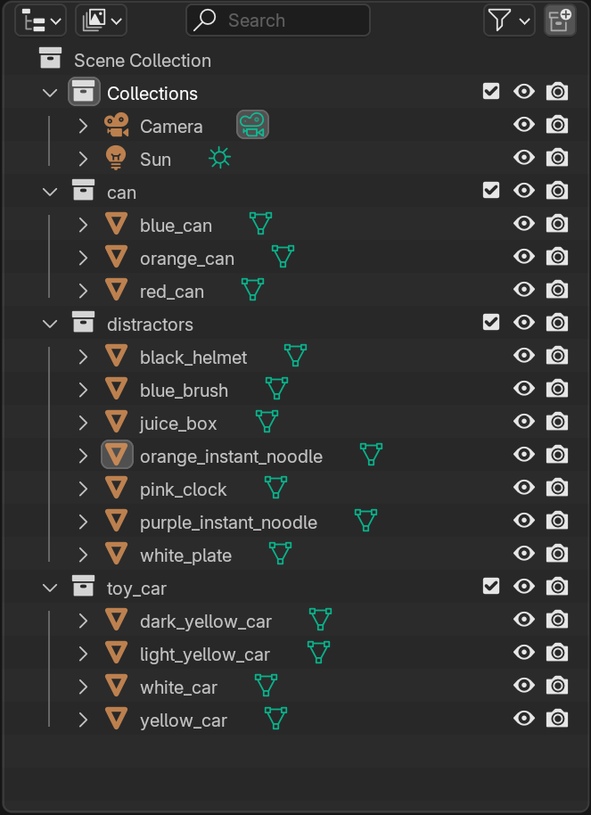

# 3D Random Placement

Generate synthetic data using 3D assets for object detection tasks.

## Required Packages

- bpy
    - Version: 4.1.0 (or 4.0.0 depending on the system)
    - ```pip install bpy==4.1.0 --extra-index-url https://download.blender.org/pypi/```

- mathutils
    - Comes with ```bpy```
    - (Optional: ```pip install mathutils```)

- bpycv
    - Version: 1.0.0
    - ```pip install bpycv```
    
- cv2
    - Version: 4.11.0.86
    - ```pip install opencv-python```

- numpy
    - Version: 2.2.6
    - ```pip install numpy```

- pymeshlab
    - Version: 2025.7
    - ```pip install pymeshlab```

- yaml
    - Version: 6.0.2
    - ```pip install pyyaml```

## Defaults

To avoide redundancy, a ```defualt.py``` file is created to store all shared paths.

## Data Preparation

### HDRI Files

- Download HDRI files from [Poly Haven](https://polyhaven.com/hdris) by running this script: ```download_hdri.py```. 

- Make sure that the text file ```hdri_ids.txt``` exists and contains valid HDRI ids. The id for a HDRI file is the same as the name displayed on the website (e.g. the id for "Moon Lab" is ```moon_lab```).

- This script utilizes Poly Haven's [API](https://redocly.github.io/redoc/?url=https://api.polyhaven.com/api-docs/swagger.json&nocors).

- The default downloading size is ```8k``` and the extension is ```.exr```.

- **Note**: You may manually download files from [Poly Haven](https://polyhaven.com/hdris), and run ```extract_hdri_names.py``` to obtain HDRI ids for future reproduction.

### 3D Models

1. Convert selected models from the PACE dataset:

    - Run this script **on its own**: ```convert_ply_to_obj.py```.

    - The default models are cans, toy cars, and selected distractors. The

    - **Suggested use case**: Reproducing our results.

    - **Note**: This script is designed specifically for converting ```.ply``` models from the PACE dataset to ```.obj``` using ```pymeshlab```. Its behavior with other datasets or file types is not guaranteed.

2. Export models from Blender:

    - Run this sciprt **inside a Blender file**: ```export_mesh_file.py```.

    - The default exporting format is ```.gltb```. Other supported formats include ```.glb``` and ```.obj```. However, these formats have not been properly tested, and may not export everything correctly. For example, the ```.obj``` option might not export the necessary ```.mtl``` file and the texture files.

    - **Suggested use case**: Importing custom (e.g. scanned) models, editing, and saving them.

    - **Note**: Before running this script, ensure that models have been edited and saved in Blender, and is ready to use. 
    
        The script also assumes a specific structure for Blender scene collections (see details below).

```
├── Scene/                            
|   ├── Scene Collection/
|   |   ├── Collections                 # Default Blender collection
|   |   ├── <category_1>/               # "can"
|   |   |   ├── <obj_1>                     # "blue_can"
|   |   |   ├── <obj_2>                     # "orange_can"
|   |   |   └── ...
|   |   ├── <category_2>/               # "toy_car"
|   |   |   ├── <obj_1>                     # "white_car"
|   |   |   ├── <obj_2>                     # "yellow_car"
|   |   |   └── ...
|   |   ├── <category_3>/               # "snack_box"
|   |   ├── ...
|   |   └── distractors/                # objects in this collection will not be labeled
```

Example scene hierarchy in Blender file.



### File Structure Visualization

Each 3D model is stored in a separate file to prevent companion files (such as materials and textures) that share the same name overwrite each other. This is particularly important when exporting from Blender, which automatically assigns default names to these files.

```                           
├── background_hdri/                    # Stores HDRI files
|   ├── <bg_1_8k>.exr                       # "moon_lab_8k"
|   ├── <bg_2_8k>.exr                       # "illovo_beach_balcony_8k"
|   └── ...
├── objects/                            # Store 3D object models
|   ├── <category_1>/                       # "can"
|   |   ├── <obj_1>/                            # "red_can"
|   |   |   ├── <obj_1>.obj                         # "red_can" (the mesh file must match the folder name)
|   |   |   ├── <material>.mtl
|   |   |   └── <texture>.png
|   |   ├── <obj_2>/                            # "white_can"
|   |   |   ├── <obj_2>.obj                         # "white_can"
|   |   |   ├── <material>.mtl
|   |   |   └── <texture>.png
|   |   └── ...
|   ├── <category_2>/                       # "toy_car"
|   ├── ...
|   └── distractors/                    # "distractors" will not be parsed as a label
```


===== not done yet =====


## Synthetic Data Generation

Implemented format: ['.obj', '.gltf', '.glb', '.stl', '.usd', '.usdc', '.usda', '.fbx']
Tested format: ['.obj', '.gltf', '.glb']

1. Headless through Blender (not recommended)
    - ```blender --background --python "generate_data.py" -- <args>```
    - Requirements: Blender >= 4.0.0
2. Headless using the standalone ```bpy``` library
    - ```python "generate_data.py" <args>```
    - Requirements: bpy >= 4.0.0
    - Note: Best practice is to use CYCLES as the render engine. Might enter bugs that are not present if running through Blender.
3. Inside Blender UI
    - In the scripting section, load ```generate_data.py``` and run. 
    - Requirements: Blender >= 4.0.0
    - Note: This script will clean the current active scene, so the best practice is to open a new file or create a new scene before running.

Note: Use absolute paths.

explain what attempts, iteration, arrangement, view angles are.... and the naming convention for each picture
mention yaml: documents current configs

explain GPU out of memory and bash file... (might even need to manually change seed numbers)

```run_generate_data.sh```

### Ouput Structure Visualization

```
output/
├── attempt_1/                          # one attempt: running the whole script once (assume seed=0)
|   ├── 1_<background_1>/               # images generated with the same background and scene layout are grouped together
|   |   ├── images/
|   |   |   ├── 1(0)_1_1_1.jpg
|   |   |   ├── 1(0)_1_1_2.jpg
|   |   |   ├── 1(0)_1_1_3.jpg
|   |   |   ├── ...
|   |   |   ├── 1(0)_1_2_1.jpg
|   |   |   ├── 1(0)_1_2_2.jpg
|   |   |   ├── 1(0)_1_2_3.jpg
|   |   |   └── ...
|   |   └── labels/
|   |   |   └── ...
|   ├── 2_<background_2>/
|   |   └── ...
|   └── ...
├── attempt_2/
|   └── ...
└── ... 
```

## Post-processing

- combine files 
```combine_output.py```

- check bbox
```check_bounding_box.ipynb```

- change labels (done elsewhere)